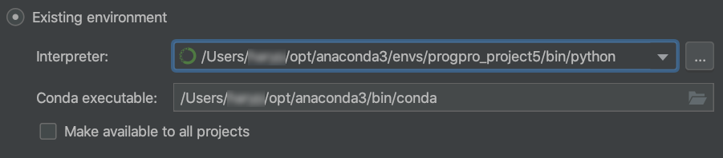
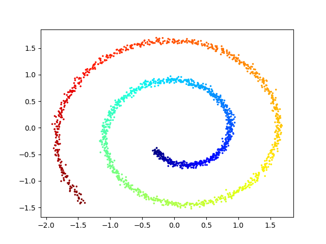
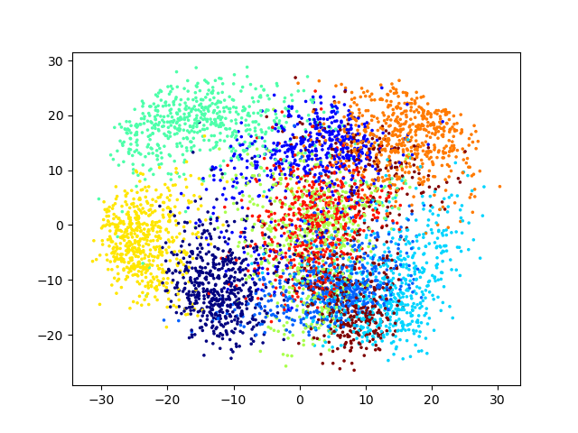
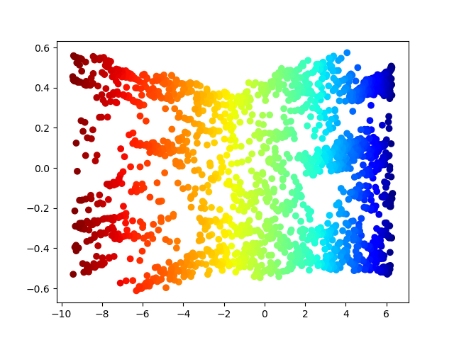
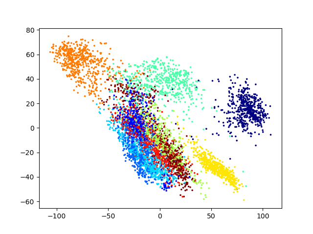
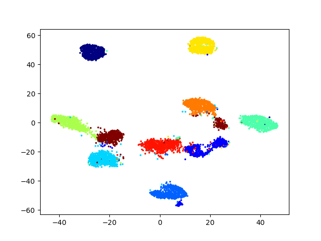

# TDT4113-Project6: Dimensionality Reduction for Visualization

## Project setup

### Terminal

1. Åpne terminal og bruk `cd`-kommandoen for å komem deg inn i riktig prosjekt.
2. Kjør koden under:
   ```bash
   conda env create -f environment.yml
   ```
   Dersom du får at kommandoen conda ikke var funnet så er ikke Anaconda installert riktig. Det hjelper å reinstallere.
3. For å sjekke at alt gikk greit, kjør koden:
   ```
   conda env list
   ```
   Dersom du ikke fikk opp `propro_project6` i lista så har steg 2 ikke gått som forventet.
4. Nå som enviromnment-en er laget, kjør koden:
   ```bash
   conda activate progpro_project6
   ```

### Pycharm

_Steg 1-4 fra Terminal-delen må være gjort før dette._

1. Åpne pycharm og velg "Open". Finn fram prosjekt-mappa og åpne den.
2. Nederst til høyre på Pycharm-prosjektvinduet, trykk på din interpretor. Det står for eksempel `Python 3.8 (...)`.
3. Trykk `Add Interpreter...`.
4. Velg `Conda Environment`.
5. Velg `Existing environment`.
6. Dersom Terminal-stegene er gjort allerede skal pycharm automatisk finne din verdiene. Det skal se lignende ut:
   
7. Trykk `OK`.

### Oppdatering av dependencies

Når du skal oppdatere dependencies så er det bare å kjøre:

```bash
conda env update -f environment.yml
```

### visualization of PCA with swiss_data



### visualization of PCA with digits



### visualization of isomap with swiss_data



### visualization of isomap with digits



### visualization of t-sne




